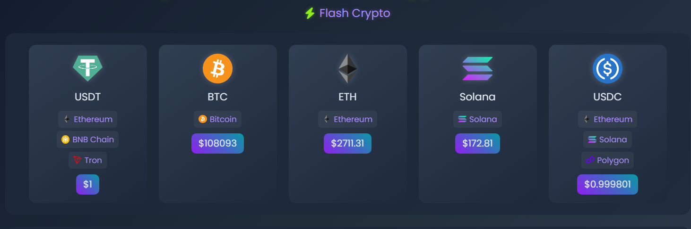
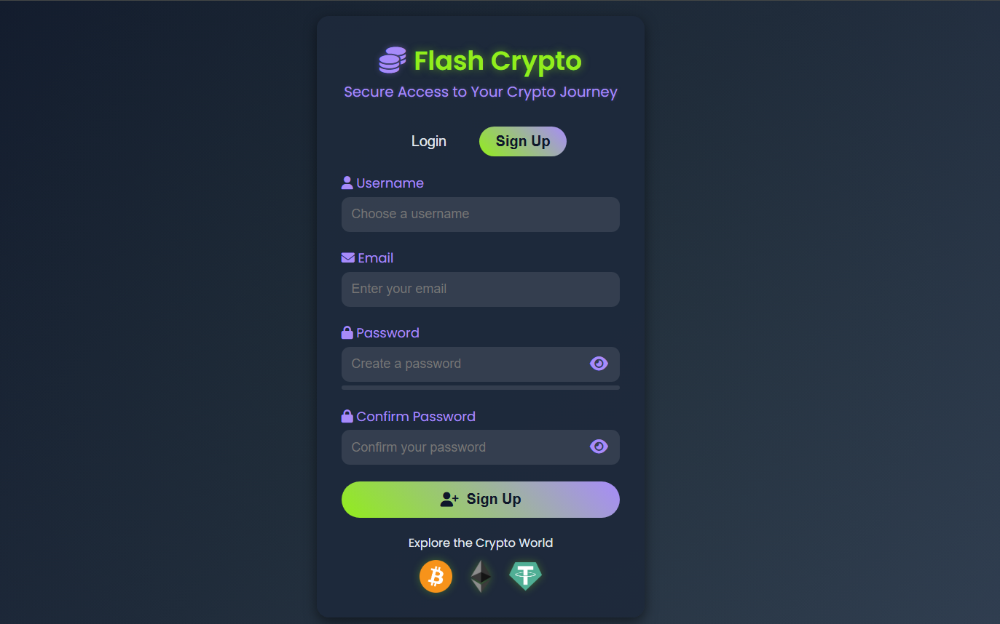
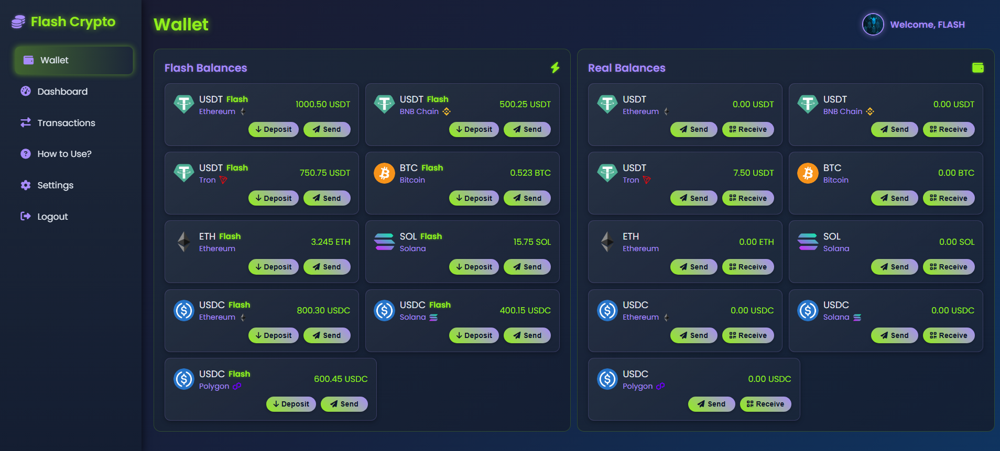
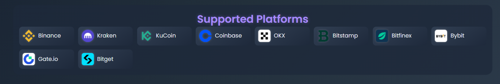
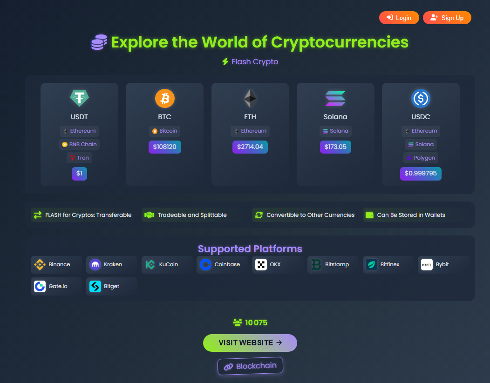

  

# 🌟 Flash Crypto 💎

🔐 **Flash Crypto** - A dynamic, secure, and visually stunning platform for managing **Flash Balances** and **Real Balances** across cryptocurrencies like **Tether (USDT)** on **TRC20**, **Bitcoin (BTC)**, **Ethereum (ETH)**, **Solana (SOL)**, and **USD Coin (USDC)**. With support for top exchanges and vibrant visuals, it’s your gateway to crypto! 🚀

**Visit the Website**: [Flash Crypto](https://flash-crypto.netlify.app) 🌐

---

## 🎉 Overview

Flash Crypto offers a colorful, user-friendly interface to explore and manage digital currencies. 🌍 From real-time price updates via CoinGecko to seamless integration with exchanges like **Binance**, **Coinbase**, and **Kraken**, it ensures a smooth experience. Whether you’re using **Flash Balances** for instant transactions or **Real Balances** for secure storage, Flash Crypto prioritizes ethics and ease of use. 🌈

---

## ✨ Key Features

- 🟢 **Instant Flash Balances**: Access **USDT**, **BTC**, **ETH**, **SOL**, and **USDC** instantly.
- 🔗 **TRC20 Network Support**: Fast, low-cost USDT transactions on Tron.
- 🌍 **Multi-Network Compatibility**: Supports **Ethereum**, **BNB Chain**, **Tron**, **Solana**, **Polygon**, and **Bitcoin**.
- 💸 **15% Withdrawal Fee**: Deducted from Real Balances for Flash transactions.
- 📈 **Real-Time Crypto Prices**: Powered by CoinGecko API.
- 📱 **Responsive Design**: Optimized for desktop, tablet, and mobile with vibrant gradients.
- 🔥 **Firebase Integration**: Secure authentication and data storage.
- 💬 **Interactive Support Chat**: Instant help via the built-in chat panel.
- 🌐 **Social Media Integration**: Connect via Telegram, Discord, X, and Facebook.
- 🏦 **Supported Platforms**: Trade on top exchanges like Binance, Coinbase, Kraken, and more.
- 🖼️ **Vibrant Logos**: Stunning logos for cryptocurrencies, networks, and Flash Crypto.

---

## 🚀 Getting Started

1. **Visit the Website** 🌐:
   - Open [Flash Crypto](https://flash-crypto.netlify.app).

2. **Sign Up** 🔐:
   - Click **Sign Up** to create an account using Firebase Authentication.
   - Access **Flash Balances** for instant crypto use.
   
   

3. **Explore Cryptocurrencies** 💰:
   - View real-time prices for **USDT**, **BTC**, **ETH**, **SOL**, and **USDC**.
   - Check supported networks (e.g., TRC20 for USDT).
   
   

4. **Discover Supported Platforms** 🏦:
   - Explore top exchanges like **Binance**, **Coinbase**, and **Kraken** for trading.
   
   

5. **Manage Balances** 💸:
   - Log in to the dashboard.
   - Send or deposit **Flash Balances** (15% fee applies).
   
6. **Get Support** 💬:
   - Use the **Support Chat** panel for instant assistance.

---

## 💲 Pricing

- **Flash Transactions**: **15% fee** deducted from Real Balances (e.g., 100 Flash USDT costs 15 Real USDT).
- **Real Balance Deposits**: No fees for depositing cryptocurrencies.
- **Flash Balance Top-Up**: Refill Flash Balances with no extra charges.

---

## ⚠️ Disclaimer

⚠️ **Important**: Flash Crypto is for **ethical and legal use only**. We prohibit fraudulent activities, including deceptive use of Flash USDT. Transactions are verified on the blockchain, and misuse may lead to account suspension. Adhere to our [Terms of Service](#).

---

## 🖼️ Flash Crypto Logo & Cryptocurrency Icons

Flash Crypto features a bold main logo and vibrant icons for cryptocurrencies and networks, stored in the `logos/` folder:

| **Item**                    | **Logo File**                | **Description**                     |
|-----------------------------|------------------------------|-------------------------------------|
| **Flash Crypto (Main Logo)**| `flash-crypto-logo.png`      | Official logo for Flash Crypto      |
| Tether (USDT)              | `tether-usdt-logo.png`       | USDT logo for TRC20, Ethereum, BNB Chain |
| Bitcoin (BTC)              | `bitcoin-btc-logo.png`       | Bitcoin logo for BTC transactions   |
| Ethereum (ETH)             | `ethereum-eth-logo.png`      | Ethereum logo for ETH and tokens    |
| Solana (SOL)               | `solana-sol-logo.png`        | Solana logo for SOL transactions    |
| USD Coin (USDC)            | `usd-coin-usdc-logo.png`     | USDC logo for Ethereum, Solana, Polygon |
| BNB Chain                  | `binance-coin-bnb-logo.png`  | BNB Chain logo for USDT/USDC        |
| Tron (TRC20)               | `tron-trx-logo.png`          | Tron logo for TRC20 USDT            |
| Polygon (MATIC)            | `polygon-matic-logo.png`     | Polygon logo for USDC transactions  |

---

## 🏦 Supported Platforms

Flash Crypto integrates with leading cryptocurrency exchanges for seamless trading:

- **Binance** 🟡
- **Coinbase** 🔵
- **Kraken** 🐙
- **KuCoin** 🟢
- **OKX** ⚫
- **Bitstamp** 🔴
- **Bitfinex** 🟣
- **Bybit** 🟠
- **Gate.io** 🔷
- **Bitget** 🔺

Each platform is displayed with its official logo, ensuring a professional and trustworthy experience. View them in the **Supported Platforms** section on the homepage.

---

## 🌐 How to Support & Contribute

### 🛠️ Developer Access Program

Help us improve Flash Crypto’s features and security! 🌟

#### How to Gain Free Access:
1. **Contribute**:
   - Fork the repository and submit pull requests with enhancements.
   - Contact us on [Telegram](https://t.me/Mistreccv) to discuss contributions.
   
2. **Submit Proof**:
   - Share your pull request or contribution details via Telegram.

3. **Receive Access**:
   - Verified contributors get **free, lifetime access** to all features.

### 🙌 For Non-Developers:
- **Subscription Access**:
  - Contact us on [Telegram](https://t.me/Mistreccv) for premium subscription details.
  - Pricing: Reach out for current rates.

---

## 💎 Special Features

- **Transferable Funds** 🔄: Move Flash and Real Balances across networks.
- **Tradeable & Splittable** 🤝: Flexible Flash Balance usage.
- **Convertible Assets** 🔀: Convert Flash Balances to other currencies.
- **Wallet Storage** 💼: Store balances in compatible wallets.
- **Dynamic User Counter** 📊: Live counter showcasing community growth.
- **Blockchain Stamp** ✅: Blockchain-verified for trust.
- **Supported Platforms** 🏦: Trade on top exchanges with ease.

---

## 📲 Stay Connected

- **Join Our Telegram** 📩:
  - Updates and community: [Join Telegram](https://t.me/Mistreccv)
  
- **Social Media** 🌐:
  - Telegram: [telegram.org](https://telegram.org)

  
- **Need Help?** 🆘:
  - Use the **Support Chat** panel or contact us on Telegram: [Support](https://t.me/Mistreccv)

---

## 📸 Screenshots

Showcase Flash Crypto’s vibrant interface with these screenshots:
1. **Flash Crypto Logo**: The main project logo.
   
2. **Homepage**: Cryptocurrencies, networks, and real-time prices.
   
3. **Sign-Up Page**: Firebase Authentication interface.
   
4. **Crypto Section**: Supported cryptocurrencies and networks.
   
5. **Supported Platforms**: Top exchanges like Binance and Coinbase.
   
6. **Support Chat**: Interactive chat panel.

---